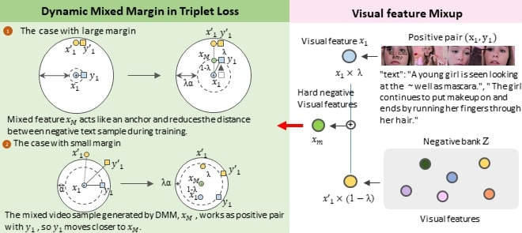

# Robust Contrastive Learning With Dynamic Mixed Margin
This repository is the official PyTorch Implementation of [Robust Contrastive Learning With Dynamic Mixed Margin](https://ieeexplore.ieee.org/abstract/document/10154052) (IEEE ACCESS)

## Abstract


One of the promising ways for the representation learning is contrastive learning. It enforces
that positive pairs become close while negative pairs become far. Contrastive learning utilizes the relative
proximity or distance between positive and negative pairs. However, contrastive learning might fail to handle
the easily distinguished positive-negative pairs because the gradient of easily divided positive-negative
pairs comes to vanish. To overcome the problem, we propose a dynamic mixed margin (DMM) loss
that generates the augmented hard positive-negative pairs that are not easily clarified. DMM generates
hard positive-negative pairs by interpolating the dataset with Mixup. Besides, DMM adopts the dynamic
margin incorporating the interpolation ratio, and dynamic adaptation improves representation learning.
DMM encourages making close for positive pairs far away, whereas making a little far for strongly nearby
positive pairs alleviates overfitting. Our proposed DMM is a plug-and-play module compatible with diverse
contrastive learning loss and metric learning. We validate that the DMM is superior to other baselines on
various tasks, video-text retrieval, and recommender system task in unimodal and multimodal settings.
Besides, representation learned from DMM shows better robustness even if the modality missing occurs
that frequently appears on the real-world dataset.

## Citation
```
@ARTICLE{10154052,
  author={So, Junhyuk and Lim, Yongtaek and Kim, Yewon and Oh, Changdae and Song, Kyungwoo},
  journal={IEEE Access}, 
  title={Robust Contrastive Learning With Dynamic Mixed Margin}, 
  year={2023},
  volume={11},
  number={},
  pages={60211-60222},
  keywords={Task analysis;Representation learning;Measurement;Business process re-engineering;Visualization;Transformers;Face recognition;Multimodal learning;contrastive learning;retrieval;video representation;recommender system;robustness},
  doi={10.1109/ACCESS.2023.3286931}}
```